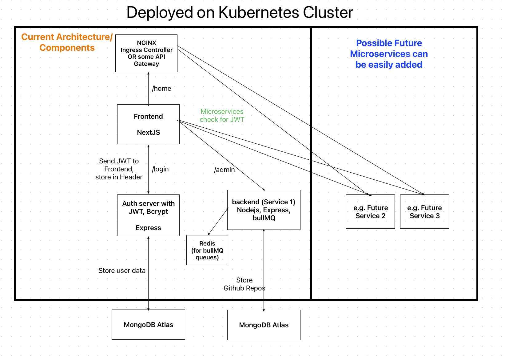
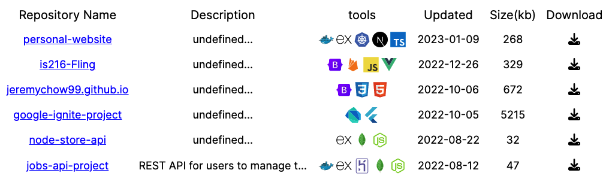

 

<h1 align="center">My Personal Website</h3>

  

     
  

<!-- ABOUT THE PROJECT -->
## About The Project

The goal of this project is to develop and deploy a website that can serve as a personal portfolio. I can also add on additional functionality and features in the future by implementing more microservices. I will be using microservices so that I can have a easily scalable and maintainable project.

I am aware that there are many platforms e.g. Firebase, Supabase that can make hosting a and deploying a small scale project like this easy and painless. However, I want to have hands-on experience using microservice architecture and principles, even if it is overkill.

## Deployment
Plan is to deploy microservices onto a Kubernetes Cluster, probably GKE or Digital Ocean, whichever is cheaper. Have tried AWS EKS before and it was quite costly. A k8s deployment is not necessary, just want to try it out.

## Frontend
### STATUS: IN PROGRESS

Choose to use React and NextJS as I want to gain more exprience with these frameworks. Frontend serves as a simple minimalistic website that displays my public github repositories dynamically. It also shows my skills. I might add on additional elements in the future.
- Fetches GitHub repo data from the backend, not directly from GitHub API.
- This is to avoid overloading GitHub if there is a large amount of requests (obviously unlikely), but wanted to apply correct design choices.
  
---
## Background Job Server
### STATUS: IN PROGRESS
A single Express server with bullMQ, which allows it to run background jobs. It pulls my GitHub repo data every 10 minutes via GitHub API and updates the database. 
- Needs to be conencted to a Redis instance for bullMQ to work.
- The data is stored in MongoDB Atlas. 
- Sends the repo data as JSON to frontend via HTTP.
- Tested to be working on local Minikube k8s cluster.
- '/admin/queues' will bring up the bullboard UI to view all bullMQ queues.

---
## Auth Server
### STATUS: TO-DO
To authenticate user (me) from the frontend login page, so that they can access bullMQ bullboard page.
- Might be useful if future features require authentication.

---

