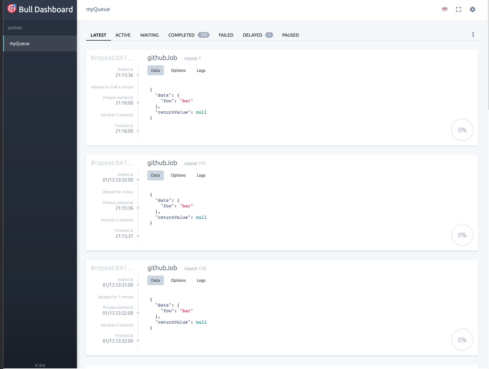

 

<h1 align="center">My Personal Website</h3>

  

     
  

<!-- ABOUT THE PROJECT -->
## About The Project

The goal of this project is to develop and deploy a website that can serve as a personal portfolio. I will be using microservices so that I can have a easily scalable and maintainable project.
- Can add on more microservices in the future easily, will make changes when I have time outside of school, and as I learn more about best practices.
- Apparently Node.js is not good at handling CPU bound tasks, so future microservices that are CPU intensive probably be done using Spring Boot.
- Might incorporate message brokers/systems (RabbitMQ, Kafka) once I have better knowledge, and if there is a good use case (just for fun).
- Need to learn how to implement the ingress controller for actual deployment.

I am aware that there are many platforms e.g. Firebase, Supabase that can make hosting a and deploying a small scale project like this easy and painless. However, I want to have hands-on experience using microservice architecture and principles, even if it is overkill.

## Deployment
Plan is to deploy microservices onto a Kubernetes Cluster (probably GKE autoscaling or Digital Ocean, whichever is cheaper). AWS EKS is pretty costly. A k8s deployment is not necessary, just want to try it out.

## Frontend
### STATUS: IN PROGRESS

Chose to use React and NextJS as I want to gain more experience with these frameworks. Frontend serves as a simple minimalistic page that displays my GitHub repositories and skills. Data generated in the table is entirely dynamic. 
- Currently very plain, might add on additional elements in the future.
- Fetches GitHub repo data from the backend, not directly from GitHub API.
- This is to avoid overloading GitHub if there is a large amount of requests (obviously unlikely).
- Tools column icons are based on topics for each Repo. Used Devicons.

  
---
## Background Job Server
### STATUS: IN PROGRESS

A single Express server with bullMQ, which allows it to run background jobs. It pulls my GitHub repo data every 10 minutes via GitHub API and updates the database. 
- Needs to be conencted to a Redis instance for bullMQ to work.
- The data is stored in MongoDB Atlas. 
- Sends the repo data as JSON to frontend via HTTP.
- Tested to be working on local Minikube k8s cluster.
- '/admin/queues' will bring up the bullboard UI to view all bullMQ queues (require user to be authenticated via JWT).

---
## Auth Server
### STATUS: DONE
To authenticate user (me) from the frontend login page, so that they can access bullMQ bullboard page.
- Express server, used Bcrypt, JSON Web Tokens.
- Has Register and Login routes. Upon registration, user credentials are salted, hashed, then stored in DB.
- Check user credentials on login, return JWT if successful. Other Microservices then check for the JWT.
- Might be more useful if future features/services require authentication.

---

